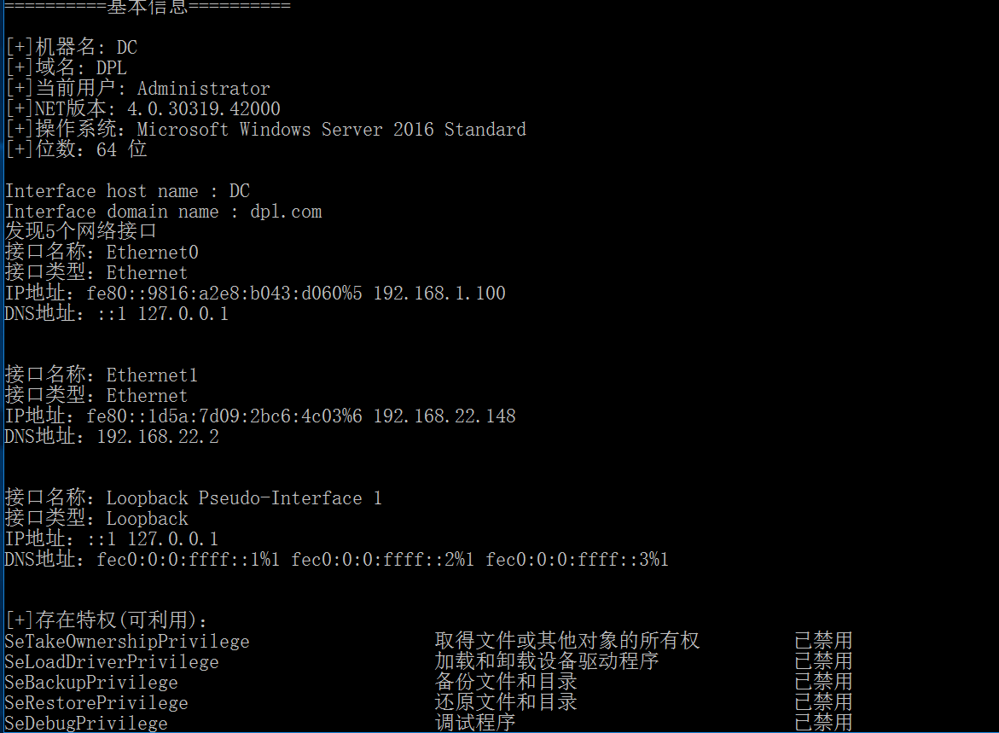
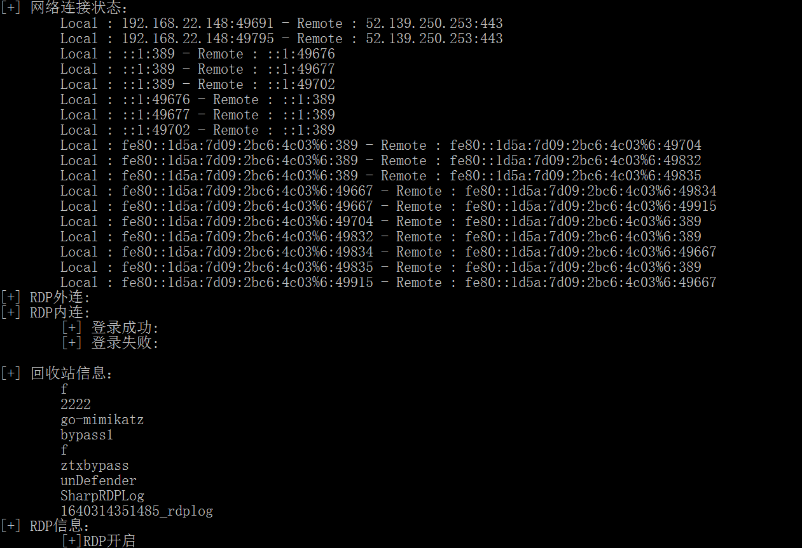
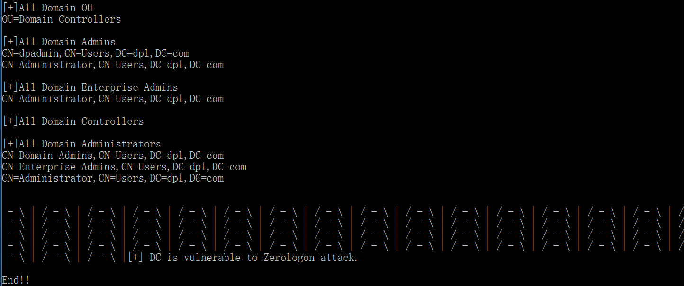

## 简介

用c#编写的一款关于工作组和域信息收集的工具，收集包括.net版本、IP信息、网络连接状态、历史RDP的内外连、回收站信息、杀软等，域内信息收集域控的FQDN以及IP、域管理员组、域企业管理员组等信息，并自动化探测域控是否有ZeroLogon漏洞。
## 用法：

直接运行

```
.\SharpGetinfo.exe
```
建议在CS上使用内存加载的方式运行，更舒服

如果存在域，当工作组信息收集完成后，会继续收集域内信息，如果当前不存在域，那么会结束工作组的信息收集

## 运行截图







## 参考链接

https://github.com/CPO-EH/CVE-2020-1472_ZeroLogonChecker

https://github.com/Heart-Sky/ListRDPConnections
